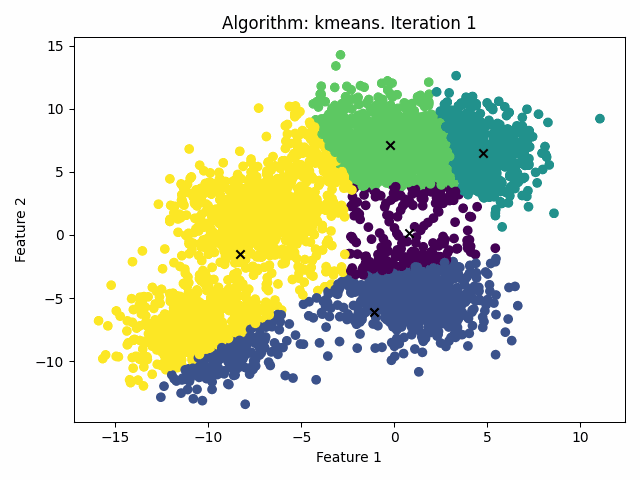
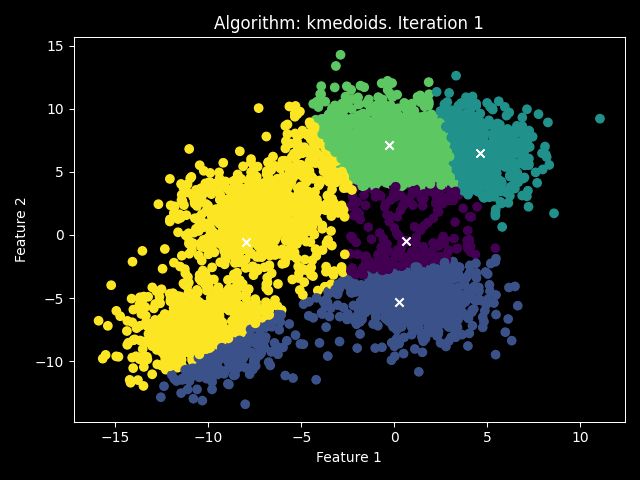

# Clustering Class

Clustering is a Python class that implements flat clustering algorithms from scratch. The code for the algorithms is inside the src folder, while the Clustering class contains the call for the algorithm and other plot methods (plot the output, plot the history of the iteration, generate a gif of the iterations).

The implemented clustering algorithms are:

- K-means
- K-means++
- K-medoids
- K-medoids++
- C-means

The Clustering class has the following attributes:

- k: the number of clusters to form.
- z: the final assignment of each point to a cluster.
- loss: the total loss after clustering, defined as the sum of the squared distances between each point and its assigned cluster center.
- C: the final cluster centers.
- n_iterations: the number of iterations required to converge.
- C_history: a record of the cluster centers at each iteration.
- z_history: a record of the assignment of each point to a cluster at each iteration.
- algorithm_variant: the variant of the algorithm to use.
- TIME: the time required to fit (s).
- U: the matrix of "probabilities".

## Installation

Clone the repository:
`git clone https://github.com/your_username/clustering.git`

## Usage

Here's an example of how to use the Clustering class:

```
import numpy as np
from sklearn.datasets import make_blobs
from ClusteringClass import Clustering

# Generate random data
X, _ = make_blobs(n_samples=1000, centers=5, random_state=42)

# Create an instance of Clustering class
clustering = Clustering(k=5)

# Fit the data
clustering.fit(X)

# Print running time to fit
clustering.time()
```

`Running time: 0.0523 seconds `

## Example

You can also specify the algorithm variant to use when creating an instance of the Clustering class.

### k-means

```
# Create an instance of Clustering class with k=5 and use K-means algorithm
kmeans = Clustering(k=5, algorithm_variant="kmeans")

# Fit the data
kmeans.fit(X)

# Plot the final partition of the data
kmeans.plot(X)
```


```
# Generate GIF
kmeans.create_gif(X)
```



### k-means++

```
# Create an instance of Clustering class with k=5 and use K-means++ algorithm
kmeanspp = Clustering(k=5, algorithm_variant="kmeans++")

# Fit the data
kmeanspp.fit(X)

# Plot the final partition of the data
kmeanspp.plot(X)
```


```
# Generate GIF
kmeanspp.create_gif(X)
```


### k-medoids

```
# Create an instance of Clustering class with k=5 and use K-medoids algorithm
kmedoids = Clustering(k=5, algorithm_variant="kmedoids")

# Fit the data
kmedoids.fit(X)

# Plot the final partition of the data
kmedoids.plot(X)
```


```
# Generate GIF
kmedoids.create_gif(X)
```



### c-means

```
# Create an instance of Clustering class with k=5 and use C-means algorithm
cmeans = Clustering(k=5, algorithm_variant="cmeans")

# Fit the data
cmeans.fit(X)

# Plot the final partition of the data
cmeans.plot(X)
```


```
# Generate GIF
cmeans.create_gif(X)
```


